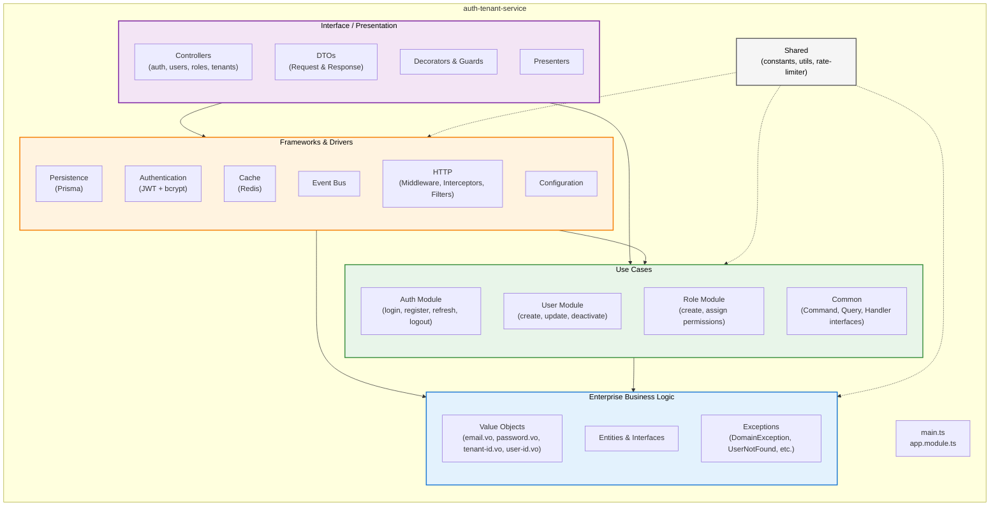

# Auth Tenant Service

Multi-tenant authentication service built with NestJS.

## Architecture

The project has the following layers:

- **Interface Layer**  
  (Controllers, DTOs, Guards, Decorators)

- **Application Layer**  
  (Commands, Queries, Handlers)

- **Domain Layer**  
  (Entities, Value Objects, Interfaces)

- **Infrastructure Layer**  
  (Prisma, JWT, Redis, Middleware, Repositories)

## Features

- Multi-tenant architecture (tenant isolation via headers)
- JWT authentication (access + refresh tokens)
- Session management with database-backed sessions
- Role-based access control (RBAC)
- Permission-based authorization
- Type-safe throughout (TypeScript)
- CQRS pattern with NestJS CQRS module
- Prisma ORM with PostgreSQL
- Input validation with class-validator
- Default role assignment on user registration

## Database Setup

```bash
# Generate Prisma client
npx prisma generate

# Run migrations
npx prisma migrate dev --name init

# Seed database
npm run prisma:seed
```

## API Endpoints

### Authentication (Public)

| Method | Endpoint                    | Description                                            |
| ------ | --------------------------- | ------------------------------------------------------ |
| POST   | `/api/auth/register`        | Register a new user (auto-assigns default role)        |
| POST   | `/api/auth/login`           | Login and get access/refresh tokens                    |
| POST   | `/api/auth/refresh`         | Get a new access token using a refresh token           |
| POST   | `/api/auth/logout`          | Invalidate the current session                         |
| POST   | `/api/auth/logout-all`      | Invalidate all user sessions (requires authentication) |
| PATCH  | `/api/auth/change-password` | Change password (invalidates all sessions)             |

### User Management (Protected)

| Method | Endpoint        | Description              |
| ------ | --------------- | ------------------------ |
| GET    | `/api/users/me` | Get current user profile |

### Role Management (Protected)

These endpoints require authentication and specific role-based permissions.

| Method | Endpoint     | Description     | Permission Required |
| ------ | ------------ | --------------- | ------------------- |
| POST   | `/api/roles` | Create new role | `role:create`       |
| GET    | `/api/roles` | List all roles  | `role:read`         |

Headers Required
All requests must include:

x-tenant-id: Your tenant identifier (UUID)

Protected routes also require:

Authorization: Bearer <access_token>

### Detailed Layer Architecture



## Project Structure

```bash
src/
├── domain/                          # Enterprise business logic
│   ├── entities/                    # Domain entities (User, Role, Tenant, etc.)
│   ├── value-objects/               # Immutable value objects (Email, Password, TenantId, etc.)
│   ├── exceptions/                  # Domain-specific exceptions
│   └── interfaces/                  # Repository and service ports
│       ├── repositories/            # Repository interfaces
│       └── services/                # Service interfaces (ports)
│
├── application/                     # Use cases / Application services
│   ├── auth/                        # Authentication use cases
│   │   ├── commands/                # Register, Login, RefreshToken, Logout
│   │   ├── handlers/                # Command handlers
│   │   └── queries/                 # GetCurrentUser, CheckPermission, etc.
│   ├── user/                        # User management use cases
│   └── role/                        # Role and permission use cases
│
├── infrastructure/                  # Frameworks, drivers & external tools
│   ├── persistence/                 # Database implementations
│   │   └── prisma/                  # Prisma repositories, mappers and schema
│   ├── auth/                        # Authentication implementations
│   │   ├── jwt/                     # JWT token service
│   │   └── strategies/              # Passport strategies
│   ├── cache/                       # Redis cache implementation
│   └── http/                        # HTTP middleware, interceptors and filters
│
├── interface/                       # Presentation / HTTP layer
│   ├── http/
│   │   ├── controllers/             # Route controllers
│   │   ├── dto/                     # Request and Response DTOs
│   │   ├── guards/                  # Authentication and authorization guards
│   │   └── decorators/              # Custom decorators
│   └── presenters/                  # Response formatters (optional)
│
└── shared/                          # Cross-cutting concerns
    ├── constants/                   # Application constants
    └── utils/                       # Helper functions and utilities
```
